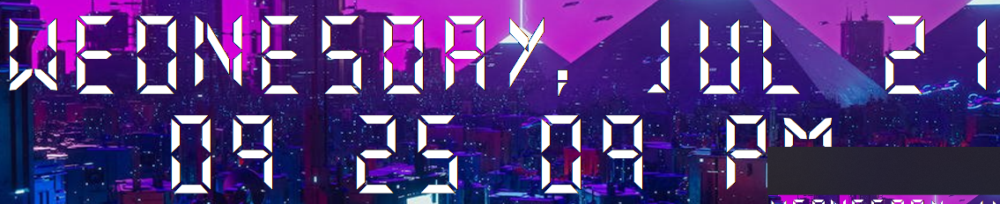

# PyDigitalClock

`This is a desktop widget or gadget that render the current datetime in format:`

	- Friday, Nov 13
	- 12:00:00 PM

`The background is transparent foremulate that behaviour of windows gadgets, render the text on center of screen and each second re render it for update the seconds and the dots between minutes and second`

## If you whant tu run it on windows use the pythonw and doble click in int for run it without cmd

## For run it on windows startup create a shortcut and copy it into startup directory

*Type the Win key and R then write shell:startup then copy here yoyr script for exec it whe system startup*